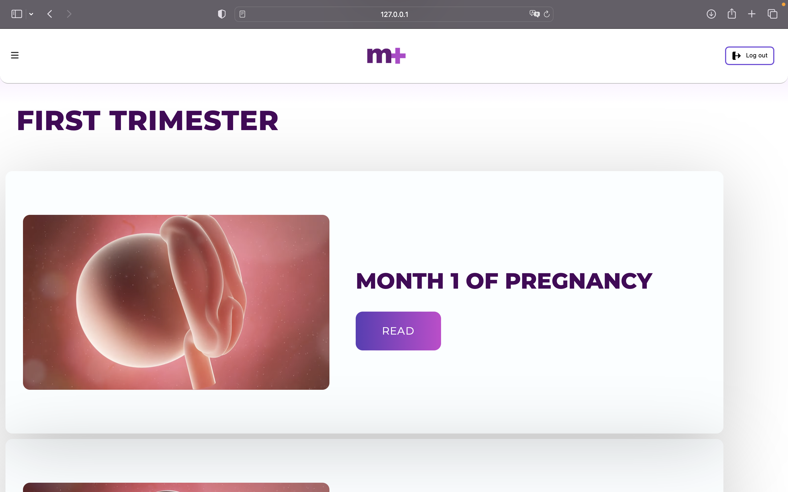

#  
Live Link: https://audreyfabiola.github.io/momplus-HCI-FP/

Demo Video Link: https://www.youtube.com/watch?v=KKu3IS0CE5Q

Class: L1AC

Team Name: AJA

Group Members:
- Clarissa Audrey Fabiola Kusnadi - 2602118490
- Jeffrey - 2602118484
- Priscilla Abigail Munthe - 2602109883

## Description of the Website 🤰

mom+ is a website designed to provide moms or their beloved ones for a mom's pregnancy journey.

## Features
Our wesite has four main features:
- 🏠 Home Page
- 📰 Month-by-month articles from reliable sources
- 📅 Due-date calculator 
- 🧮 BMI calculator

## Contents

### HTML 

- index.html - sign in and sign up page
- index1.html - home page
- index2.html - month-by-month articles page
- index2-1.html, index2-2.html, index2-3.html, index2-4.html, index2-5.html, index2-6.html, index2-7.html, index2-8.html, index2-9.html - article pages
- index3.html - due date calculator
- index4.html - BMI calculator

## CSS Files
- style.css - stylesheet for index.html
- style1.css - stylesheet for index1.html
- style2.css - stylesheet for index2.html
- style2-1.css - stylesheet for index2-1.html, index2-2.html, index2-3.html, index2-4.html, index2-5.html, index2-6.html, index2-7.html, index2-8.html, index2-9.html
- style3.css - stylesheet for index3.html
- style4.css - stylesheet for index4.html

## JS Files
- script.js - js for index.html 
- script1.js - js for index1.html
- script2.js - js for index2.html 
- script2-1.js -used for index2-1.html, index2-2.html, index2-3.html, index2-4.html, index2-5.html, index2-6.html, index2-7.html, index2-8.html, index2-9.html
- script3.js - js for index3.html
- script4.js - js for index4.html 

## Others
- Assets - folder for images used in the source code
- Documents - Other necessary documents such as poster, mockup, storyboard, test cases, scenarios, and report

## Screenshots of the Website
 
 
 
 
 
 
 
 
